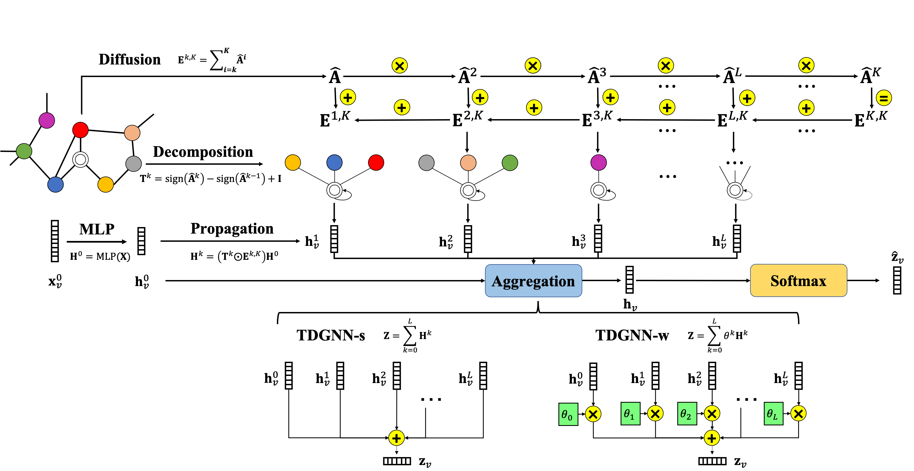
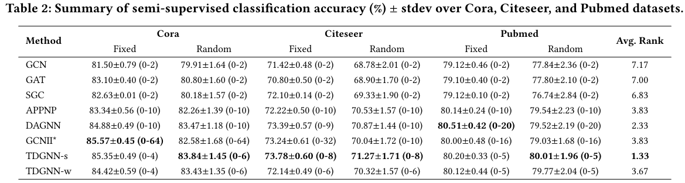
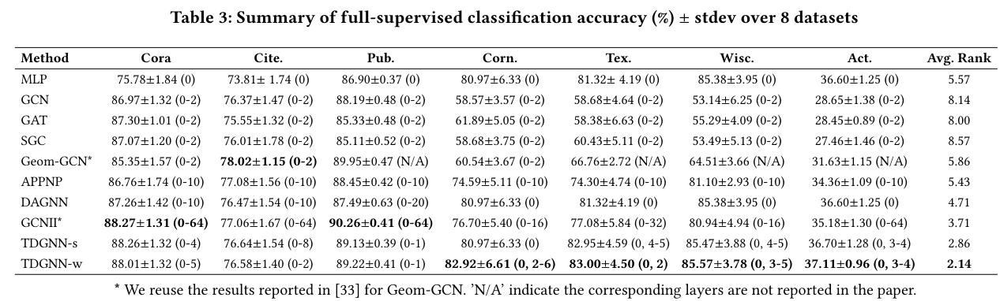

# TDGNN
This repository is an official PyTorch(Geometric) implementation of TDGNN in "Tree Decomposed Graph Neural Network" ([CIKM 2021](https://arxiv.org/abs/2108.11022)).

For more insights, (empirical and theoretical) analysis, and discussions about Tree Decomposed Graph Neural Networks, please refer to our paper following below.



## Requirements
* PyTorch 1.8.1+cu111
* PyTorch Geometric 1.7.0
* NetworkX 2.5.1
* Other frequently-used ML packages

Note that the version of PyTorch and PyTorch Geometric should be compatible and PyTorch Geometric is related to other packages, which requires to be installed beforehand. It is recommended to follow the [installation instruction](https://pytorch-geometric.readthedocs.io/en/latest/notes/installation.html#).

## Run
* To reproduce our results in the following Table, run
```linux
bash run.sh
```



<strong> Note that our TDGNN requires the tree decomposition of the network beforehand, which can be generated automatically by running main.py. For example, when we run TDGNN on Cora dataset, two files are generated in the folder tree_info as follows: </strong>
* <strong> hop_edge_index_Cora_k:</strong> the edge_index file including all edges between each node and their neighborhoods up to 10-hops away.
* <strong> hop_edge_att_Cora_k:</strong> the edge_att file including attention(edge weights) of the corresponding edge between each node and their neighborhoods up to 10-hops away.
